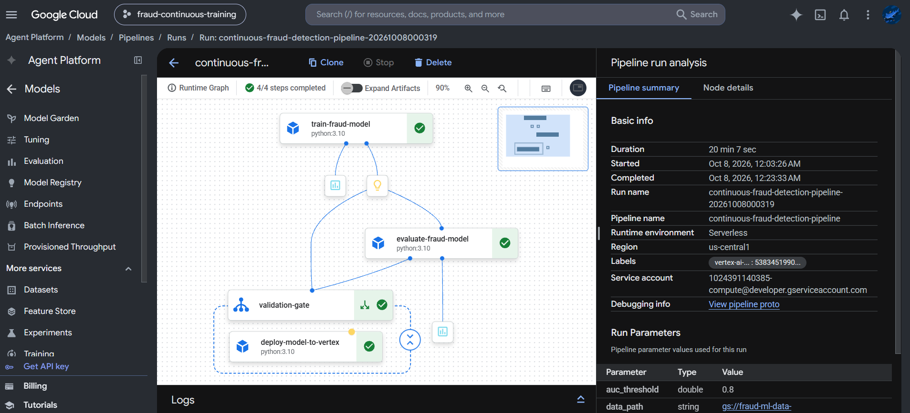
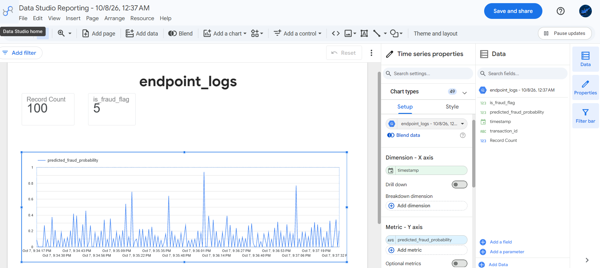

# Serverless MLOps: Distributed Fraud Detection Pipeline

An end-to-end, fully managed Continuous Training (CT) pipeline designed to process massive, highly imbalanced financial transaction data. This project demonstrates enterprise-grade data engineering, automated machine learning orchestration, and real-time endpoint monitoring on Google Cloud Platform.

## 🏗️ Architecture Overview

The system is decoupled into three distinct phases:

1. **Distributed Data Engineering (Dataproc & Dataplex):**
   * Raw Kaggle IEEE-CIS Fraud data lands in a Cloud Storage Data Lake.
   * **Dataplex** enforces data quality rules (validating schema and target distributions).
   * **Dataproc Serverless (PySpark)** handles memory-intensive broadcast joins and outputs optimized Parquet shards to a processed zone.
2. **Continuous Training (Vertex AI & Kubeflow):**
   * A **Kubeflow Pipeline (KFP)** automatically triggers upon new data arrival.
   * The pipeline trains an **XGBoost** classifier, handles the extreme class imbalance (`scale_pos_weight`), and evaluates ROC-AUC.
   * A conditional deployment gate automatically registers and serves the model to a Vertex AI Endpoint if performance thresholds are met.
3. **Real-Time Monitoring (BigQuery & Looker Studio):**
   * Live inference traffic is simulated via Python, hitting the Vertex endpoint.
   * Predictions and probability scores are streamed directly into **BigQuery**.
   * A **Looker Studio** dashboard visualizes real-time fraud flags and monitors for data drift.

## 🗄️ Data Ingestion
This project utilizes the massive [IEEE-CIS Fraud Detection Dataset](https://www.kaggle.com/c/ieee-fraud-detection). Following MLOps best practices, raw data is excluded from version control and managed directly within Google Cloud Storage.

To replicate this pipeline, download the dataset via the Kaggle CLI and upload it to your designated Data Lake:

kaggle competitions download -c ieee-fraud-detection
unzip ieee-fraud-detection.zip
gcloud storage cp train_transaction.csv gs://<YOUR-BUCKET-NAME>/raw/
gcloud storage cp train_identity.csv gs://<YOUR-BUCKET-NAME>/raw/

## 📊 Visualizing the Pipeline

### 1. Automated MLOps Execution (Vertex AI)

*The compiled Kubeflow pipeline dynamically provisioning resources, training the XGBoost model, and deploying to a live endpoint.*

### 2. Real-Time Business Monitoring (Looker Studio)

*Live BigQuery traffic simulation tracking prediction probability distribution and capturing flagged fraudulent transactions.*

## ⚙️ Core Scripts

* `dataproc_etl/spark_etl.py`: PySpark logic for handling multi-gigabyte dataset joins and feature engineering without Out-Of-Memory (OOM) errors.
* `mlops_pipeline/pipeline.py`: The Python KFP definition dictating the cloud execution DAG.
* `mlops_pipeline/simulate_traffic.py`: Restructures Pandas DataFrames into raw 2D NumPy matrices for serving container compatibility and streams logs to BigQuery.

## Engineering Highlight: Bypassing Vertex AI Schema Mismatches
When serving XGBoost models, standard Pandas DataFrames often trigger schema-mismatch errors in Vertex AI prediction containers due to embedded column metadata. To ensure robust real-time serving, I engineered the pipeline to strip DataFrames into raw 2D NumPy matrices prior to payload transmission, entirely decoupling the model from hardcoded feature names and eliminating serialization crashes.

## 👨‍💻 Author
**Ayub**
Google Cloud Certified Professional Machine Learning Engineer
